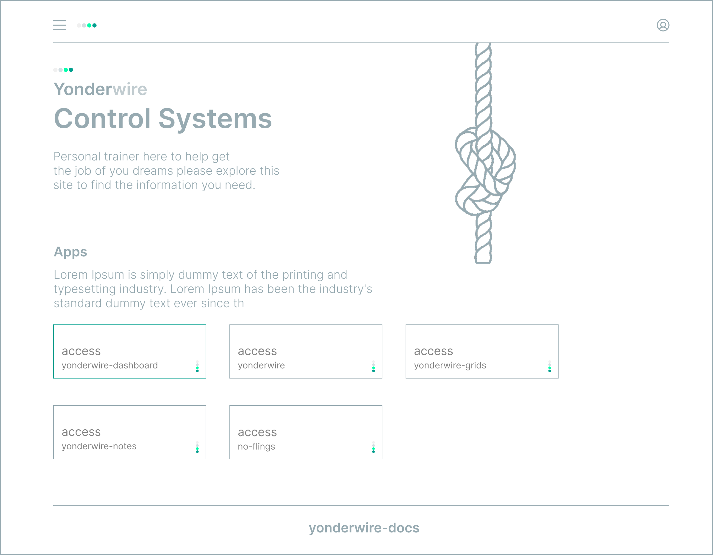
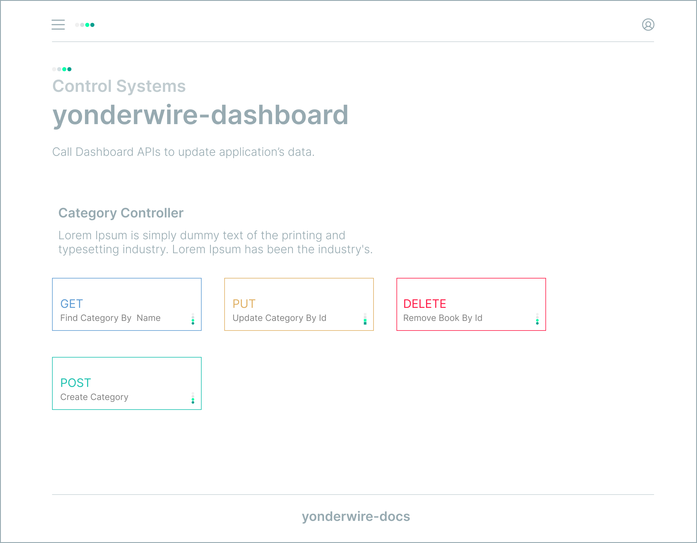

### Yonderwire Control System
A robust application designed to orchestrate and execute API calls for seamless updates across distributed systems.

  &nbsp;&nbsp;
  

### Key Features 
- Tech Stack  `Java 11`  `Springboot`  `React 18` `TypeScript 5.3`
- Database `MariaDB` `PostgreSQL`
- Tracking `Jira`
- API Documentation `Swagger`
- Usage Documentation `Notion`
- Microservice Tools  
  - Messaging Queue `Kafka`  
  - Orchestration `Docker`
- UI Libraries
   - [x] [Tailwind CSS v4.1](tailwindcss.com)
   - [x] [UI Kit Catalyst](https://catalyst.tailwindui.com/docs/dialog)
   - [ ] Headless UI v2.1
   - [ ] [animations](motion.dev)
   - [ ] ui.shadcn.com
   - [ ] [icons](radix-ui.com)
 

